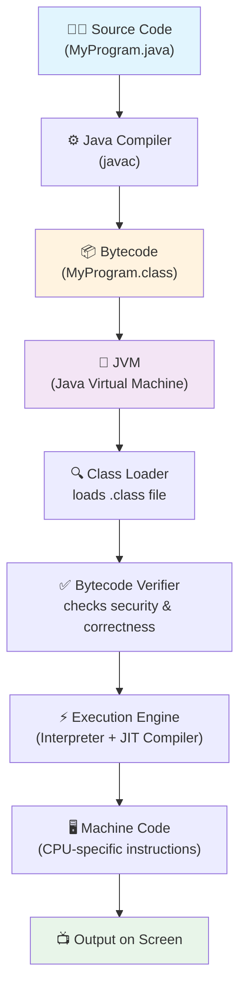
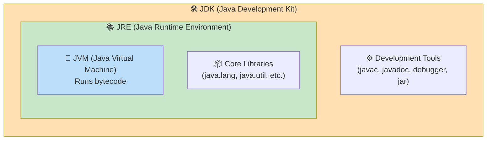

# ☕ Java Execution Flow — Complete Beginner Guide

> 📅 Daily Learning Log — Java Fundamentals
> Push this to your GitHub repo as `Day-XX-java-execution-flow.md`

---

## 1. Big Picture: What Happens When You Run Java Code?

When you write Java code and run it, it goes through **4 major stages**:

```
Your Code (.java) → Compiler (javac) → Bytecode (.class) → JVM → Machine Code → Output
```

Here is the full flow as a diagram:



---

## 2. Step-by-Step Explanation

### 🔹 Step 1: You Write Source Code
You write your program in a plain text file with a `.java` extension.

```java
public class HelloWorld {
    public static void main(String[] args) {
        System.out.println("Hello, World!");
    }
}
```

This file is **human-readable** but the computer cannot run it directly.

---

### 🔹 Step 2: Compilation (javac)
The **Java Compiler (`javac`)**, which comes with the JDK, takes your `.java` file and converts it into **bytecode**.

```
javac HelloWorld.java
```

- Bytecode is **not** machine code (0s and 1s for a specific CPU).
- Bytecode is a special **intermediate language** — same for every operating system.
- This step creates a new file: `HelloWorld.class`

📌 **Key Point:** This is why Java is called "Write Once, Run Anywhere" (WORA) — the bytecode is platform-independent.

---

### 🔹 Step 3: The `.class` File (Bytecode)
The `.class` file contains bytecode instructions. It looks like gibberish if opened in a text editor, but it's a set of instructions the **JVM** understands.

You never run `.class` files with `javac` again — instead, you hand it to the **JVM**.

---

### 🔹 Step 4: JVM Takes Over
When you type:

```
java HelloWorld
```

The **JVM (Java Virtual Machine)** starts and does the following internally:

| Sub-Component | What it Does |
|---|---|
| **Class Loader** | Loads the `.class` file into memory |
| **Bytecode Verifier** | Checks the code doesn't violate security rules (no illegal memory access, etc.) |
| **Execution Engine** | Converts bytecode → machine code and runs it |

The **Execution Engine** has two parts:
1. **Interpreter** — reads bytecode line by line and executes it (slower, but starts fast)
2. **JIT Compiler (Just-In-Time)** — compiles frequently-used bytecode directly into native machine code so it runs faster on repeat use

---

### 🔹 Step 5: Machine Code Execution
The Execution Engine converts bytecode into **machine code** — the actual binary instructions your **CPU** (Intel, AMD, ARM, etc.) understands.

This machine code is now specific to:
- Your operating system (Windows/Mac/Linux)
- Your CPU architecture

That's the JVM's job — it acts as a **translator** between the universal bytecode and your specific machine.

---

### 🔹 Step 6: Output
Finally, the machine code executes, and the result (e.g., `Hello, World!`) is printed to your terminal/screen.

---

## 3. JDK vs JRE vs JVM — What's the Difference?

This confuses almost every beginner. Here's the simplest way to understand it:



### Simple Analogy 🍳
Think of it like cooking:

| Component | Analogy | What it Contains |
|---|---|---|
| **JVM** | The stove | Actually "cooks" (runs) your bytecode |
| **JRE** | Kitchen with stove + ingredients | JVM + core libraries needed to run programs |
| **JDK** | Full kitchen + recipe books + cooking tools | JRE + compiler (`javac`) + tools to **write and build** programs |

### Quick Comparison Table

| Feature | JVM | JRE | JDK |
|---|---|---|---|
| Full Form | Java Virtual Machine | Java Runtime Environment | Java Development Kit |
| Purpose | Executes bytecode | Runs Java applications | Develops + runs Java applications |
| Contains Compiler? | ❌ No | ❌ No | ✅ Yes (`javac`) |
| Contains JVM? | — (it IS the JVM) | ✅ Yes | ✅ Yes (includes JRE) |
| Who needs it? | Needed by JRE internally | End-users who just **run** apps | Developers who **write & compile** apps |
| Platform Dependent? | ✅ Yes (different JVM per OS) | ✅ Yes | ✅ Yes |

📌 **Simple Rule:** If you want to **write** Java code → install **JDK**.
If you only want to **run** an existing Java app → **JRE** is enough (though most people just install JDK today).

---

## 4. How to Run Java Code in the Terminal (Step-by-Step)

### ✅ Step 1: Check Java is Installed
```bash
java -version
javac -version
```

### ✅ Step 2: Write Your Code
Create a file named `HelloWorld.java` (file name **must match** the public class name):

```java
public class HelloWorld {
    public static void main(String[] args) {
        System.out.println("Hello, World!");
    }
}
```

### ✅ Step 3: Compile the Code
```bash
javac HelloWorld.java
```
➡️ This generates `HelloWorld.class` in the same folder.

### ✅ Step 4: Run the Compiled Bytecode
```bash
java HelloWorld
```
⚠️ Note: No `.class` or `.java` extension when running — just the class name.

### ✅ Step 5: See the Output
```
Hello, World!
```

### 🆕 Bonus: Single-File Run (Java 11+)
For quick testing, you can skip the manual compile step:
```bash
java HelloWorld.java
```
This compiles **and** runs in memory in one command (great for learning/testing).

---

## 5. Full Command Cheat-Sheet

| Command | Purpose |
|---|---|
| `java -version` | Check installed Java runtime version |
| `javac -version` | Check installed compiler version |
| `javac FileName.java` | Compile source code into bytecode |
| `java FileName` | Run the compiled `.class` file via JVM |
| `java FileName.java` | Compile + run directly (Java 11+) |
| `javac *.java` | Compile all `.java` files in a folder |
| `jar cf app.jar *.class` | Package `.class` files into a `.jar` |

---

## 6. Quick Recap (One-Line Summary)

> **You write `.java` code → `javac` compiles it into `.class` bytecode → JVM loads, verifies, and executes that bytecode (via interpreter/JIT) by converting it into machine code → CPU runs it → Output appears on screen.**

---

## 7. Tips for Your Daily GitHub Learning Log 📌

Since you're pushing this daily, here's a clean workflow:

```bash
# 1. Navigate to your repo
cd your-java-learning-repo

# 2. Add today's file
git add Day-01-java-execution-flow.md

# 3. Commit with a clear message
git commit -m "Day 1: Learned Java execution flow, JVM/JRE/JDK"

# 4. Push to GitHub
git push origin main
```

💡 **Tip:** Keep a consistent naming pattern like `Day-01-topic.md`, `Day-02-topic.md` — this creates a great visible learning trail (and GitHub contribution graph!) for recruiters/mentors to see your consistency.

---

*Happy Learning! 🚀 Keep pushing daily — consistency beats intensity.*
